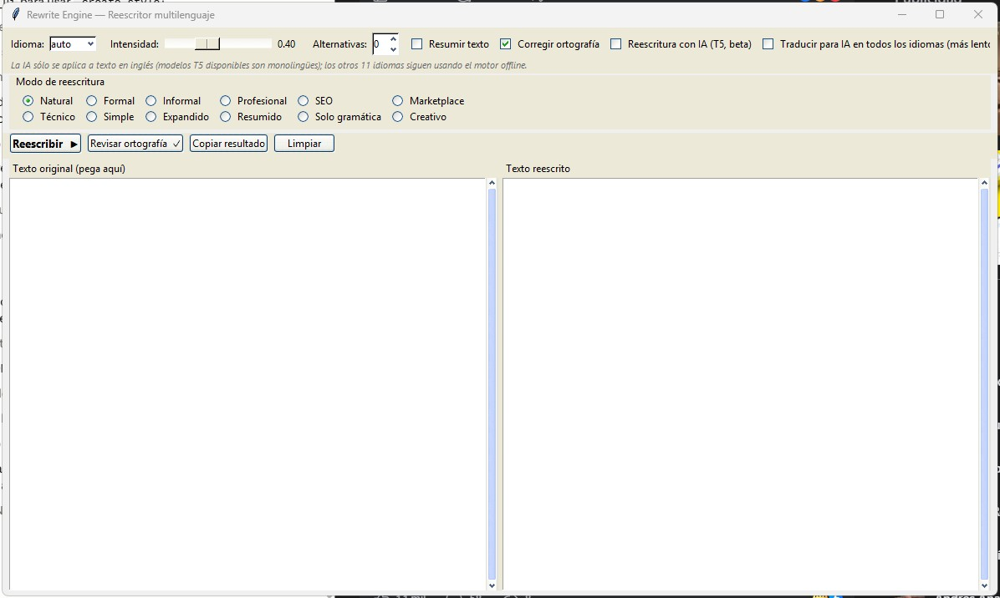

# rewrite-engine

**Reescritura inteligente, natural y multilenguaje** — motor híbrido *offline* (diccionarios de sinónimos + WordNet/OMW + NLP) con interfaz lista para enchufar un LLM. No es un "spinner" tonto: protege entidades, valida el significado y respeta el tono.

> *Intelligent, natural, multilingual text rewriting — a hybrid offline engine (synonym dictionaries + WordNet/OMW + NLP) with an optional pluggable LLM layer.*

---


<p align="center"></p>

## ✨ Características

- **Híbrido y offline**: funciona 100% local y gratis (diccionarios JSON + WordNet/OMW). Sin API keys.
- **IA opcional y enchufable**: implementa `BaseTransformer` para añadir Claude, un paraphraser de HuggingFace, etc., sin tocar el núcleo. Incluye un toggle listo para usar con un T5 ligero (ver [Reescritura con IA](#-reescritura-con-ia-t5-beta) más abajo).
- **Multilenguaje**: es, en, pt, fr, it, de, nl, pl, ru, uk, sv, eo (Esperanto) — y fácil de extender.
- **Protección de entidades**: URLs, emails, teléfonos, fechas, precios, %, SKUs/códigos, hashtags, menciones, **HTML** y markdown nunca se rompen.
- **12 modos**: `natural, formal, informal, professional, seo, marketplace, technical, simple, expanded, summarized, grammar_only, creative`.
- **Validación semántica**: embeddings multilenguaje si están disponibles; si no, similitud léxica robusta.
- **Degradación elegante**: spaCy, sentence-transformers y LanguageTool son opcionales; el motor corre sin ellos.
- **Seguridad**: avisa ante claims médicos sensibles y no los reescribe; respeta marcas y palabras protegidas.

## 📦 Instalación

```bash
# Núcleo (ligero, suficiente para reescribir):
pip install -e .

# Con WordNet/OMW (recomendado para sinónimos multilenguaje):
pip install -e ".[wordnet]"
python -c "import nltk; nltk.download('wordnet'); nltk.download('omw-1.4')"

# Todo lo razonable (API, CLI, embeddings, spaCy, gramática):
pip install -e ".[all]"
```

Extras disponibles: `wordnet`, `api`, `cli`, `semantic`, `spacy`, `grammar`, `ai` (Claude/nube), `ai-paraphrase` (T5 local), `desktop`, `build-exe`, `all`, `dev`.

## 🚀 Uso (Python)

```python
from rewrite_engine import RewriteEngine, RewriteRequest

engine = RewriteEngine()
result = engine.rewrite(RewriteRequest(
    text="Necesito ayuda para arreglar este error en mi sitio web.",
    language="auto",          # o "es", "en"...
    mode="formal",
    strength=0.5,             # 0.1 mínimo … 0.9 muy creativo
    preserve_keywords=["Mananpa Labs"],
    avoid_words=[],
    return_alternatives=2,
))

print(result.rewritten)
# → "Necesito apoyo para arreglar este defecto en mi sitio web."
print(result.similarity_score, result.readability_score)
print(result.changed_words)
```

## 🖥️ CLI

```bash
rewrite-engine "Este producto es bueno y barato, cómpralo ahora." --lang es --mode marketplace --strength 0.4
echo "Buy this product now." | rewrite-engine - --lang en --mode natural
```

## 🪟 App de escritorio (.exe)

Interfaz gráfica de **dos paneles** (izquierda: texto original · derecha: texto
reescrito) con:
- **los 12 modos** como opciones seleccionables (natural, formal, informal,
  profesional, seo, marketplace, técnico, simple, expandido, resumido, solo
  gramática, creativo);
- checkbox **"Resumir texto"** (resumen extractivo real, offline);
- selector de idioma, control de intensidad, nº de alternativas;
- **corrector ortográfico offline** que subraya las palabras desconocidas y
  ofrece correcciones con clic derecho, en ambos paneles;
- botones Reescribir, Revisar ortografía, Copiar resultado y Limpiar.

```bash
# Ejecutar desde el código
pip install -e ".[desktop]"
rewrite-engine-gui                 # o: python -m rewrite_engine.desktop.app

# Generar el ejecutable autónomo (Windows)
pip install -e ".[build-exe]"
pyinstaller packaging/rewrite_engine_gui.spec --noconfirm    # → dist/RewriteEngine.exe
```

El corrector combina `pyspellchecker` (en/es/fr/pt/de/ru/nl) con un respaldo de
`wordfreq` (it/pl/uk/sv y más), cubriendo los 11 idiomas naturales (Esperanto no
tiene corrector). El `.exe` (por defecto, sin el toggle de IA) es autónomo,
incluye los diccionarios y excluye las dependencias pesadas.

**Tema visual XP/Windows 7**: la app usa `winxpblue` (paquete `ttkthemes`,
incluido en el extra `[desktop]`) — azul XP-Luna, igual en cualquier versión
de Windows. Si `ttkthemes` no está instalado, cae a los temas nativos de
Tcl/Tk `vista`/`xpnative` (sin dependencia extra, look nativo del SO pero
no necesariamente idéntico al de XP/7).

> ⚠️ `ttkthemes` es **GPL-3.0-or-later** (copyleft): si distribuyes el `.exe`
> empaquetado con este tema a terceros, GPL obliga a poder entregar el código
> fuente completo del programa a quien lo reciba si lo pide. No hay problema
> de pago (es gratis), sólo esa obligación de divulgación al distribuir.

## 🧠 Reescritura con IA (T5, beta)

Checkbox opt-in en la GUI ("Reescritura con IA (T5, beta)") y flag `--ai` en el
CLI que añaden una pasada de **parafraseo neuronal** sobre el resultado del
motor offline, usando un modelo T5 ligero de HuggingFace
(`mrm8488/t5-small-finetuned-quora-for-paraphrasing` por defecto, ~240 MB).

```bash
pip install -e ".[ai-paraphrase]"     # transformers + torch + sentencepiece
rewrite-engine "I need help to fix this error." --lang en --ai --explain
```

```python
from rewrite_engine import RewriteEngine
from rewrite_engine.transformers.t5_paraphraser import T5ParaphraserTransformer

engine = RewriteEngine(transformer=T5ParaphraserTransformer())
```

**¿Hay que alojar el modelo en algún servidor propio? No.** `transformers`
descarga el modelo **una sola vez** a la caché local de HuggingFace
(`~/.cache/huggingface/hub`, o `%USERPROFILE%\.cache\huggingface\hub` en
Windows) y, tras esa primera descarga, corre **100% localmente y sin
conexión** — sin llamadas a HuggingFace ni a ningún servidor en cada uso, sin
costo por petición.

**Limitaciones honestas de esta función (por eso es "beta" y opt-in):**
- **Sólo aplica a texto en inglés.** Los parafraseadores T5 disponibles
  públicamente son monolingües; en los otros 11 idiomas el toggle no tiene
  ningún efecto (se comunica explícitamente en la UI, no es una degradación
  silenciosa).
- **El modelo por defecto está afinado sobre pares de preguntas de Quora**
  (Question Paraphrasing), así que parafrasea muy bien preguntas y, con la
  decodificación determinista que usa este proyecto (`num_beams=4,
  do_sample=False`, por el principio de determinismo del motor), a menudo deja
  intactas las frases declarativas — no es un fallo, sino la naturaleza del
  modelo: en ese caso el motor conserva el resultado del paso léxico offline.
- **Guardas de seguridad activas:** el candidato del T5 se descarta (se
  conserva el texto sin IA) si pierde algún token protegido, si su longitud se
  dispara o se desploma, o si repite una cláusula en bucle (fallo real
  observado en modelos pequeños, p.ej. invertir sujeto/objeto y repetir la
  frase). Además pasa por la misma puerta de similitud semántica que el resto
  del motor.
- **Licencias de los modelos:** `mrm8488/t5-small-finetuned-quora-for-paraphrasing`
  no declara una licencia explícita en su tarjeta de HuggingFace (verifica los
  términos de HuggingFace antes de un uso comercial). Alternativa más pesada y
  con mejor cobertura de frases declarativas: `Ateeqq/Text-Rewriter-Paraphraser`
  (T5-Base, ~850 MB, **Apache-2.0**) — pásalo como
  `T5ParaphraserTransformer(model_name="Ateeqq/Text-Rewriter-Paraphraser")`.
- Esta capa **no** está incluida en el `.exe` ligero por defecto (`torch` por
  sí solo pesa varios cientos de MB); es una función para quien instale desde
  código con el extra `[ai-paraphrase]`.

### Puente de traducción: IA para los 12 idiomas

Checkbox adicional en la GUI ("Traducir para IA en todos los idiomas") y flag
`--ai-translate` (junto con `--ai`) en el CLI. Extiende la IA (que por sí sola
sólo entiende inglés) a **cualquiera de los 12 idiomas**: traduce el texto a
inglés, aplica el T5, y traduce el resultado de vuelta.

```bash
rewrite-engine "Necesito ayuda para arreglar este error." --lang es --ai --ai-translate --explain
```

```python
from rewrite_engine.transformers.t5_paraphraser import T5ParaphraserTransformer
from rewrite_engine.transformers.translation_bridge import TranslationBridgeTransformer

engine = RewriteEngine(transformer=TranslationBridgeTransformer(inner=T5ParaphraserTransformer()))
```

Usa `Helsinki-NLP/opus-mt-<idioma>-en` / `opus-mt-en-<idioma>` (MarianMT), un
modelo por idioma (~300 MB c/u, se descargan bajo demanda). Se eligió sobre
otras alternativas **evaluadas y descartadas con motivos verificados**:

- ~~`google/mt5-small` (mT5)~~ — descartado: su propia tarjeta de modelo dice
  que "debe afinarse (fine-tune) antes de poder usarse en una tarea downstream"
  (se preentrenó sólo con corrupción de spans, sin ninguna tarea supervisada).
  Conectarlo tal cual para parafraseo produce texto sin sentido — verificado.
  No existe un fine-tune de mT5 fiable que cubra los 12 idiomas del proyecto.
- ~~`facebook/nllb-200-distilled-600M` (Meta)~~ — buena calidad, pero licencia
  **CC BY-NC 4.0 (no comercial)**, incompatible con el resto del stack.
- ~~`alirezamsh/small100`~~ — MIT, pero su tokenizer requiere código remoto de
  terceros (`trust_remote_code=True`), un riesgo de cadena de suministro que
  se prefiere evitar.
- ~~`google/translategemma-4b-it`~~ — sí existe, pero es un modelo
  **imagen-texto** (no traductor de texto puro), 4B parámetros (pesado, pide
  GPU) y licencia Gemma personalizada. No encaja con el perfil ligero/CPU/texto
  del proyecto.
- ✅ `Helsinki-NLP/opus-mt-*`: **Apache-2.0**, sin código remoto, cubre incluso
  Esperanto (`opus-mt-eo-en`, verificado), tokenizer nativo de `transformers`.

**Limitación honesta, verificada empíricamente (no una suposición):** un
round-trip de traducción limpio reconstruye el original con fidelidad. Pero si
la capa léxica offline ya sustituyó una palabra por un sinónimo cuestionable
(ruido de WordNet, ver más abajo), la traducción la propaga tal cual — no la
introduce, pero tampoco la corrige. Se comprobó que **ni la similitud léxica ni
los embeddings reales (`[semantic]`, umbral ≥0.88) detectan de forma fiable**
este patrón (un verbo sustituido por otro relacionado pero distinto, p.ej.
"cierra"→"bloquea"): ambos miden similitud de la frase completa, no corrección
palabra por palabra, así que una frase con una sola palabra mal traída puede
seguir puntuando muy alto. Es una limitación de la similitud a nivel de
oración en general, no algo exclusivo de este puente.

## 🌐 API

```bash
uvicorn rewrite_engine.api.app:app --reload
# POST http://127.0.0.1:8000/api/rewrite  (ver schema más abajo)
```

`POST /api/rewrite`:

```jsonc
// petición
{ "text": "...", "language": "auto", "mode": "natural", "strength": 0.35,
  "preserveKeywords": ["Mananpa Labs", "Shomex"], "avoidWords": [], "returnAlternatives": 3 }

// respuesta
{ "original": "...", "rewritten": "...", "alternatives": [], "language": "es",
  "similarityScore": 0.92, "readabilityScore": 0.86, "changedWords": [],
  "protectedTerms": [], "warnings": [] }
```

## 🏗️ Arquitectura

```
src/rewrite_engine/
  core/      models · config · pipeline · engine (orquestador)
  lang/      metadata · detector · protector (entidades) · tokenizer (sin pérdida) · morphology (concordancia)
  synonyms/  base · dict_source (JSON) · wordnet_source (OMW) · engine
  rewrite/   candidates · scorer (semántico/legibilidad) · sentence · grammar · ai_scorer · ranker
  transformers/ base (interfaz IA) · null (offline por defecto) · t5_paraphraser (T5 opt-in) ·
    translation_bridge (extiende IA a 12 idiomas vía MarianMT) · _guards (guardas compartidas)
  api/ · cli/
data/
  dictionaries/{es,en,pt,fr,it,de,nl,pl,ru,uk,sv,...}/general.json   # editables
  protected/brands.json
```

Flujo: **detectar idioma → proteger entidades → tokenizar → generar candidatos → puntuar → reescribir por oración → (gramática/IA opcional) → restaurar → rankear**.

## ➕ Añadir idiomas y diccionarios

1. **Idioma nuevo**: añade su código y metadatos en `lang/metadata.py`
   (`DEFAULT_LANGUAGES`, stopwords, palabras función, intensificadores, spaCy
   opcional y WordNet/OMW opcional). Si quieres activarlo por entorno, usa
   `REWRITE_ENGINE_LANGUAGES=es,en,...`.
2. **Diccionario nuevo**: crea `data/dictionaries/<idioma>/general.json` (o `marketplace.json`, `legal.json`, `technical.json`) con el formato:

```json
{
  "word": "comprar", "lemma": "comprar", "pos": "VERB", "language": "es",
  "synonyms": [
    {"text": "adquirir", "formality": "formal", "frequency": 0.82,
     "contexts": ["marketplace", "legal"], "avoidContexts": ["informal"]}
  ],
  "antonyms": ["vender"]
}
```

3. **Industria nueva**: añade su nombre a `industries` en la config para cargar `data/dictionaries/<idioma>/<industria>.json`.
4. **Idiomas sin espacios claros** (p.ej. chino, japonés, tailandés): añade antes
   diccionarios y validación lingüística específica. El tokenizer ya incluye una
   segmentación Unicode conservadora para `zh`, `ja` y `th`, pero no se declaran
   idiomas de primera clase hasta tener diccionarios y pruebas de calidad.

## 🤖 Enchufar un LLM (futuro)

Implementa `rewrite_engine.transformers.base.BaseTransformer` (`available`, `refine(text, language, mode)`) y pásalo al motor:

```python
engine = RewriteEngine(transformer=MiTransformerDeClaude())
```

El motor lo usará como etapa de refinado **después** de la reescritura léxica, preservando los tokens protegidos.

## ⚠️ Limitaciones (motor offline)

- **WordNet sin embeddings introduce ruido.** Como respaldo de los diccionarios, WordNet/OMW puede ofrecer sinónimos de una acepción equivocada (mala desambiguación). Se mitiga con: prioridad a los diccionarios JSON curados, filtro de formas derivadas, lista de intensificadores intocables y limitación de acepciones. Para máxima calidad, instala `[semantic]`: los embeddings activan la **puerta semántica estricta** (≥0.88) que descarta cambios que alteran el significado.
- **La validación semántica sin embeddings es léxica.** El floor por defecto sólo atrapa divergencias casi totales; no distingue una buena paráfrasis de un cambio sutil de sentido. Con `[semantic]` la validación es real.
- **POS sin spaCy es limitado.** Sin `[spacy]`, la protección de nombres propios usa heurística (mayúscula a media frase). Instala `[spacy]` y el modelo del idioma para NER/POS de calidad.
- **Calidad por idioma desigual.** es/en tienen diccionarios más ricos; pt/fr/it/de/nl/pl/ru/uk/sv tienen diccionarios sembrados más pequeños y dependen más de WordNet/OMW. Amplía los JSON para igualar la calidad (ver sección anterior).
- **Modos `expanded`/`creative`** rinden mejor con un LLM enchufado (`BaseTransformer`); offline son limitados y lo advierten. `summarized` ya es un resumen extractivo real y offline (`rewrite/summarizer.py`).
- **Concordancia morfológica** (género/número/conjugación) en es/pt/fr/it/de: **mejorada con `[spacy]`** (`lang/morphology.py`) — adjetivos y sustantivos concuerdan en género/número (`bonita→hermosa`, no `hermoso`) y los verbos se conjugan en presente-3ª persona (`transforma→cambia`, no el infinitivo `cambiar`). Deliberadamente **no** se conjugan otros tiempos/modos ni verbos con cambio de raíz (irregulares como poder→puede): sin una tabla de irregulares, una conjugación mal hecha sonaría peor que dejar el reemplazo sin flexionar. El alemán sólo extrae los rasgos (declinación de adjetivos demasiado compleja para reglas de sufijo). Sin `[spacy]`, sigue el comportamiento anterior (forma base del diccionario).

## ⚖️ Licencias

Este proyecto: **MIT**.

Material de referencia usado durante el diseño (carpeta `repos/`):

| Repo | Licencia | Uso en este proyecto |
|------|----------|----------------------|
| `humanizer-workbench` | MIT | Patrón de arquitectura por interfaces, scorer de AI-likeness. Adaptado. |
| `HUMAN-AI` | MIT | Listas lingüísticas (burned-words, tonos) por idioma. Convertidas a datos. |
| **`Humanizer` (VHumanize)** | **CC BY-NC 4.0** ⚠️ | **No comercial.** Solo se usó como *referencia conceptual*; su código **no** se copió. La lógica de WordNet aquí es una reimplementación de la API pública de NLTK. |
| `NLP` (Mayaluri) | notebook | Referencia conceptual de back-translation. |

> ⚠️ **Aviso**: no incorpores código de `Humanizer/` (VHumanize) en un producto comercial: su licencia CC BY-NC lo prohíbe. Las dependencias del motor (`nltk`, `spacy`, `wordfreq`, `sentence-transformers`, `langdetect`, `simplemma`, `beautifulsoup4`, `rapidfuzz`) son todas permisivas (MIT/Apache/BSD). `language-tool-python` es opcional (LGPL / API).

**Modelos de IA opcionales** (extra `[ai-paraphrase]`, ninguno se descarga por defecto):

| Modelo | Licencia | Uso |
|--------|----------|-----|
| `mrm8488/t5-small-finetuned-quora-for-paraphrasing` | sin licencia declarada en HF | Paráfrasis en inglés (toggle IA por defecto). Verifica los términos de HuggingFace antes de uso comercial. |
| `Ateeqq/Text-Rewriter-Paraphraser` | Apache-2.0 | Alternativa de paráfrasis en inglés, más pesada, mejor en frases declarativas. |
| `Helsinki-NLP/opus-mt-*` (MarianMT) | Apache-2.0 | Puente de traducción (extiende la IA a los 12 idiomas). |

> ⚠️ **Evaluados y descartados** (ver §Puente de traducción), cada uno por un motivo distinto, no por una política general de licencias:
> - `google/mt5-small` — **motivo técnico**: no funciona tal cual, necesita fine-tuning (verificado en su propia tarjeta de modelo).
> - `facebook/nllb-200-distilled-600M` — **motivo legal de uso, no de pago**: licencia **CC BY-NC 4.0**, que prohíbe explícitamente el uso *comercial* del modelo (no es una cuestión de pagar por él, sino de qué usos permite su licencia).
> - `alirezamsh/small100` — **motivo de seguridad**: su licencia (MIT) no es el problema; requiere ejecutar código Python remoto de terceros (`trust_remote_code=True`) para el tokenizer.
> - `google/translategemma-4b-it` — **motivo de diseño**: es un modelo de imagen-texto (no traductor de texto puro), 4B parámetros, pensado para GPU.
>
> **`ttkthemes`** sí se usa (extra `[desktop]`): es software libre y gratuito, sin costo de uso. Su única implicación real es de **distribución**: al ser GPL-3.0-or-later, si empaquetas el `.exe` con este tema y lo distribuyes a terceros, GPL exige que puedas entregarles el código fuente completo del programa si lo solicitan.

## 🧪 Tests

```bash
pip install -e ".[dev]"
pytest -q -m "not integration"  # tests rápidos en verde, sin descargas ni modelos
pytest -q                       # + tests de integración (T5 real, spaCy real; se saltan si faltan)
ruff check src tests
```

GitHub Actions ejecuta `pytest` y `ruff` en Python 3.11 y 3.13.
